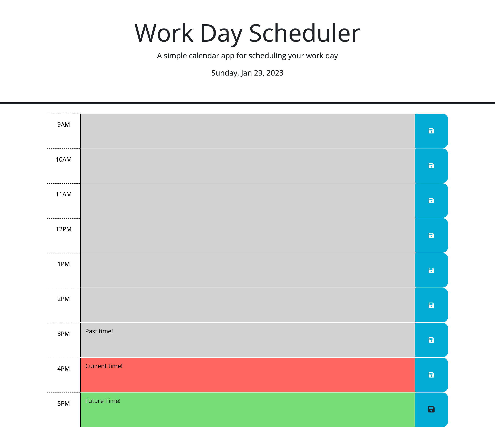

# 05 Third-Party APIs: Work Day Scheduler

## Your Task

Create a simple calendar application that allows a user to save events for each hour of the day by modifying starter code. This app will run in the browser and feature dynamically updated HTML and CSS powered by jQuery.

You'll need to use the [Day.js](https://day.js.org/en/) library to work with date and time. Be sure to read the documentation carefully and concentrate on using Day.js in the browser.

## User Story

```md
AS AN employee with a busy schedule
I WANT to add important events to a daily planner
SO THAT I can manage my time effectively
```

## Acceptance Criteria

```md
GIVEN I am using a daily planner to create a schedule
WHEN I open the planner
THEN the current day is displayed at the top of the calendar
WHEN I scroll down
THEN I am presented with timeblocks for standard business hours
WHEN I view the timeblocks for that day
THEN each timeblock is color coded to indicate whether it is in the past, present, or future
WHEN I click into a timeblock
THEN I can enter an event
WHEN I click the save button for that timeblock
THEN the text for that event is saved in local storage
WHEN I refresh the page
THEN the saved events persist
```

## Notes
This webpage was created primarily with jQuery. It consists of several functions to save the users input in each time block to local storage so the data persists. To enter time, the user can click into one of the time blocks on the left, enter their notes and then click the corresponding save button icon on the right!

Using DayJS, the current day and date is displayed at the top of the page.

Additionally, using DayJS, there is a function which updates the colors of the time blocks. Time appearing in grey is in the past, current hour time block is red and future time blocks will be green. 


## Screenshots of Final Product
Here is a screenshot of the deployed application:


Here is a screenshot of the calendar in aciton along with explanations of past, present and future times:


## Link to deployed application
Please find the link to the deployed application here: 
https://ionscion.github.io/pentagonal-calendar-5/